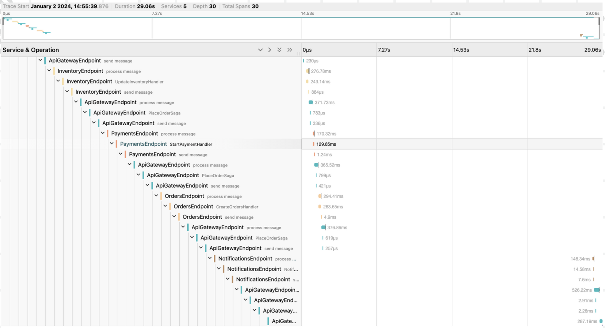

# Microservice enhanced Saga pattern for resilience

This project was developed for experimentation in order to enhance system resilience against transient faults, using Saga pattern, Kubernetes, and Chaos Engineering.

## Features

- [.Net 8] - Latest .Net version (Dec 2023).
- [Kubernetes] - Used for its self-healing and automatic scaling features.
- [Chaos-Mesh] - Used to run Chaos Engineering experiments in order to discover flaws against transient faults in complex systems.
- [Open Telemetry] - Used for recollecting traces of distributed transactions.
- [Jaegger Tracing] - Used for data visualization of traces of distributed transactions.
- [RabbitMq] - Used for decoupling development of microservices and automatic load balancing of application load.
- [MongoDb] - Used for datastore, in order to test data integrity in case of failure and rollback of saga

## Chaos Engineering Experiments

The following experiments where executed in order to discover flaws and increase system resilience

- Pod Failure
- Stress Failure
- Network Outage

## Data Visualization

With distributed transactions, each microservice can be bottle neck. Data visualization facilitates the identification of a bottle neck.

## Results

Results are in research paper in research folder.

[//]: # "These are reference links used in the body of this note and get stripped out when the markdown processor does its job. There is no need to format nicely because it shouldn't be seen. Thanks SO - http://stackoverflow.com/questions/4823468/store-comments-in-markdown-syntax"
[.Net 8]: https://dotnet.microsoft.com/en-us/download/dotnet/8.0
[Chaos-Mesh]: https://chaos-mesh.org/docs/
[Open Telemetry]: https://opentelemetry.io/docs/
[Jaegger Tracing]: https://www.jaegertracing.io/docs/1.53/features/
[RabbitMq]: https://www.rabbitmq.com/tutorials/tutorial-two-python.html
[Kuberentes]: https://kubernetes.io/
[MongoDb]: https://www.mongodb.com/
